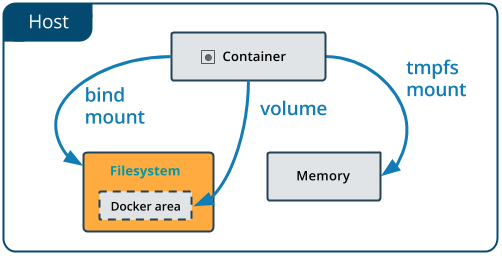
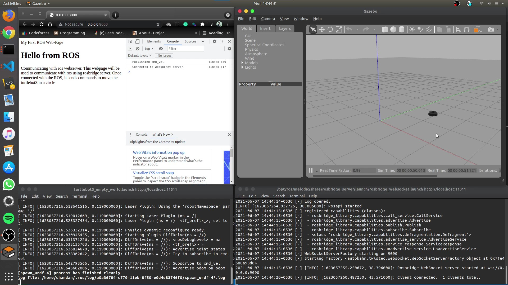
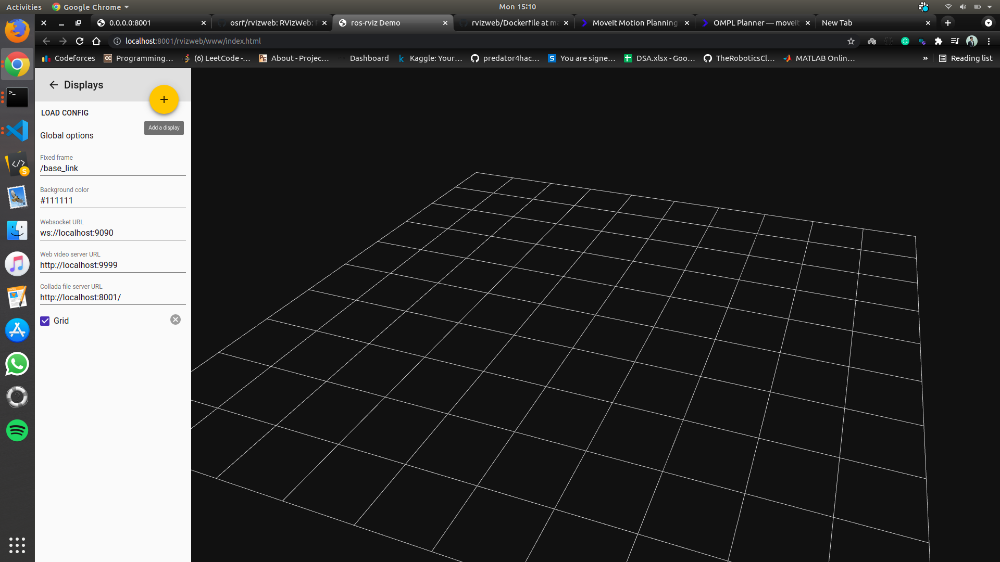

## Docker Bind Mount

The first step in starting development in a docker container is to use bind mounts or volumes so that the changes in the docker container can be seen without having to rebuild the image. Bind mounts can be used to create side-by-side development environments and also to share data that needs to persist longer than the lifespan of the docker container.

When you use a bind mount, a file or directory on the host machine is mounted into a container. The file or directory is referenced by its absolute path on the host machine. By contrast, when you use a volume, a new directory is created within Docker’s storage directory on the host machine, and Docker manages that directory’s contents.

<p align="center"></p>

### Warnings and errors

#### ROS GPG Key Expiration

ROS GPG keys inadvertently expired and caused apt failures for a number of users. A full description of the security breach and the remediation can be found in this [ROS Discourse post](https://discourse.ros.org/t/new-gpg-keys-deployed-for-packages-ros-org/9454).

To fix this issue one will need to update the public key used for ROS apt repositories. To do this for ROS 1 installations you need to run a single command:

```curl -s https://raw.githubusercontent.com/ros/rosdistro/master/ros.asc | sudo apt-key add -```

A [commit](https://github.com/JdeRobot/RoboticsAcademy/commit/842c0758a856c7119b6435fc8f17907bd17fdab1) has been created in order to fix this issue.

#### RLE Exception

After successfully mounting the container with my local repository, I discovered that none of the exercises are connecting to the server and following error was displayed:

```RLE Exception: [./RoboticsAcademy/exercises/follow_line/web-template/launch/simple_line_follower_ros_headless.launch] is not a launch file name The traceback for the exception was written to the log file```

After altering the GAZEBO_RESOURCE_PATH and paths in instruction.json, the error was rectified.

## GazeboWeb Testing

Robotics Academy uses GazeboWeb as a front-end graphical interface to gzserver which provides visualization of the simulation. Gzweb lets you interact with the simulation from the comfort of a web browser. This means cross-platform support, minimal client-side installation, and support for mobile devices.

To learn how Gzweb works, I made a basic webpage, connected it to ROS with rosbridge server, and used the roslibjs package  to drive turtlebot3 around in a circle.  A short video below demonstrates the moving turtlebot after recieving commands from html page.

[](https://youtu.be/rP4x-JGfC0c)


## RvizWeb Testing

Rviz is required for Industrial Robot exercises, and RviWeb is one method for incorporating Rviz into a web page. RVizWeb provides a convenient way of building and launching a web application with features similar to RViz. This [documentation](https://github.com/osrf/rvizweb) contains further information on RvizWeb.

<p align="center"></p>

## Using Bullet for Collision Checking

According to the project proposal, we planned to use bullet for collision checking. Bullet has continuous collision capabilities. This means that it can be guaranteed that no collision occurs during the transition between two discrete robot states with the environment.

<p align="center"></p>

Bullet's only drawback is that it is not compatible with all versions. Bullet is a ROS1-Noetic and ROS2-Foxy. I also discovered that the bullet took a long time to compute the place of collision (much slower than using traditional non-continuous collision). As a result, I feel we can put the process of adding bullets into the industrial robot exercise on hold until we get to Noetic.